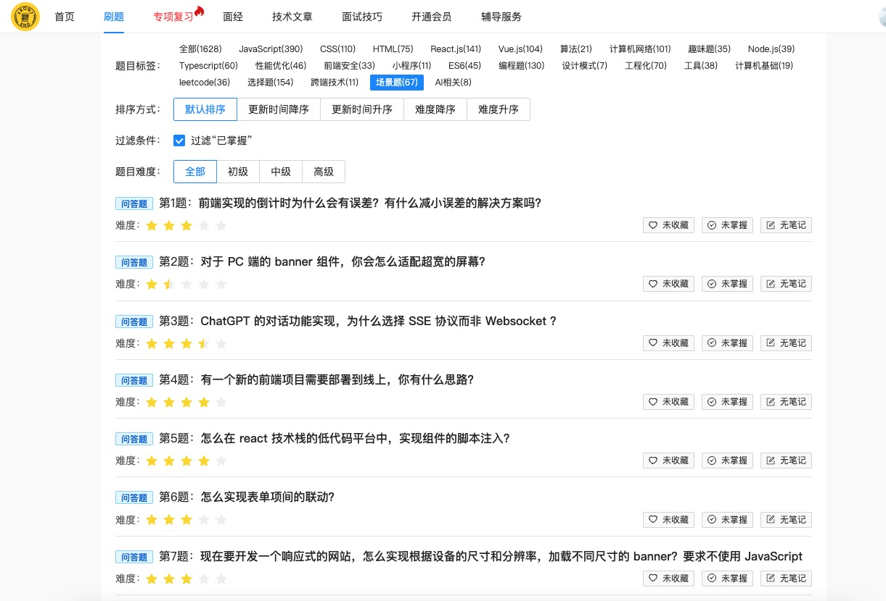

相信很多小伙伴面试中都被闻到过你的项目有什么难点或亮点？在前端交流群里也经常看到有小伙伴问，我的项目没有亮点怎么办？今天这篇文章不仅通过实际的项目实例来带大家一起挖掘项目的难点亮点，还会通过公式化的流程来教大家如何自己的项目如何去回答这类问题。希望大家读完之后，都可以清晰的回答出自己的项目中有哪些值得去给面试官分享的难点亮点，将自己的能力很好的展现出来。

另外，如果有需要刷前端面试题的小伙伴，也可以方案我们的面试题题库，不仅仅有最全的八股文，算法题，还有现在面试中很重要的场景题，以及前端知识点的复习，让你查漏补缺，刷题更有目的。传送门：[https://fe.ecool.fun](https://fe.ecool.fun/?ic=KIQC2F&from=github)

以下是正文：

## 引言：解读面试官的真实意图

在前端面试中，"请介绍一下你项目中的难点和亮点"是一个出现频率高达85%的核心问题，几乎成为了每场技术面试的标配。为什么面试官如此青睐这个问题？因为通过这个看似简单的提问，面试官能够一次性评估多个关键维度：你的技术深度、解决问题的能力、项目贡献度、表达能力，甚至是你对技术的热情。

当面试官抛出这个问题时，他们并不只是想了解你做过什么项目，而是在寻找证据证明你能为他们的团队带来价值。一个出色的回答能让面试官看到你的技术实力和潜力，而糟糕的回答则可能直接导致面试失败，无论你的简历多么亮眼。

根据我对数百场前端面试的分析，超过60%的候选人在回答这个问题时表现不佳——要么过于笼统，要么夸大其词，要么无法清晰表达技术要点。本文将系统地解析如何在前端面试中完美回答项目难点与亮点，帮助你在这个关键问题上脱颖而出。

## 项目案例深度剖析

### 1. C端项目案例：电商平台商品详情页

#### 完整项目介绍

**项目背景**：我们开发了一个大型电商平台的商品详情页，日均PV超过500万，是用户购买决策的核心页面。

**技术栈**：

*   前端框架：React 18 + TypeScript
*   状态管理：Redux Toolkit
*   样式解决方案：Styled-components + Tailwind CSS
*   构建工具：Vite
*   性能监控：Lighthouse + Web Vitals
*   测试工具：Jest + React Testing Library

#### 如何提炼难点

0.  **识别技术挑战**：分析项目中遇到的技术瓶颈，如性能问题、复杂交互等
1.  **量化问题**：用数据说明问题的严重性，如"首屏加载时间超过3秒"
2.  **关注用户痛点**：从用户体验角度发现的问题，如"规格选择错误率高"

#### 难点展示（完整版）

**性能优化难点**： "商品详情页包含大量商品图片、SKU信息和动态内容，初始版本首屏加载时间达到3.2秒，远超业界1秒的标准，直接影响用户转化率。我主导了一系列性能优化措施：

0.  实现了基于视口的图片懒加载策略，只加载用户可见区域的图片
1.  采用图片CDN服务，根据设备自动调整图片分辨率和格式（WebP/AVIF）
2.  实现资源预加载策略，通过`<link rel="preload">`预加载关键资源
3.  应用代码分割，将非首屏必需的JavaScript代码拆分为独立chunk
4.  优化第三方脚本加载，使用`async`/`defer`属性延迟非关键脚本

通过这些措施，首屏加载时间从3.2秒优化到1.5秒，提升了53%的加载速度，页面性能得分（Lighthouse）从62分提升到91分，最终带来了15%的转化率提升。"

**复杂交互难点**： "商品规格选择系统涉及多维度组合（如颜色、尺寸、材质等），存在库存约束和价格联动，初始版本用户操作错误率高达30%。我设计了一套完整的状态管理方案：

0.  设计了基于有向图的SKU数据结构，高效处理多维度规格组合
1.  实现了基于Redux的状态管理，处理规格选择的联动关系
2.  开发了智能库存提示系统，在用户选择过程中实时反馈可用组合
3.  设计了规格可视化展示组件，直观展示不同规格的视觉差异
4.  增加了一键选择推荐组合功能，简化用户决策过程

这套方案将规格选择错误率从30%降低到3%，大幅提升了用户体验，同时简化了后续SKU管理的开发难度。"

#### 如何提炼亮点

0.  **寻找创新点**：你使用的新技术或独特解决方案
1.  **对比行业标准**：你的方案与行业常见做法的优势对比
2.  **强调影响力**：你的工作对项目、团队或公司的积极影响

#### 亮点展示（完整版）

**技术创新亮点**： "面对商品评论区长列表渲染性能问题，我研究并实现了基于Intersection Observer的虚拟列表技术：

0.  自主设计了基于视口检测的虚拟滚动组件，只渲染可见区域的评论内容
1.  实现了数据预加载机制，在用户滚动前预先加载下一批数据
2.  开发了滚动位置记忆功能，确保用户返回时能恢复之前的浏览位置
3.  优化了DOM回收策略，减少内存占用和GC压力
4.  将组件抽象为可复用的高阶组件，供团队其他项目使用

这一技术使得即使加载上万条评论数据，页面滚动帧率仍保持在60fps，内存占用减少70%，该组件现已成为公司前端组件库的标准组件，被6个不同项目采用。"

**用户体验亮点**： "为解决用户等待焦虑问题，我设计了一套完整的加载体验优化方案：

0.  设计并实现了与UI一致的骨架屏组件，精确模拟页面布局和内容
1.  开发了基于Service Worker的数据预缓存策略，实现二次访问秒开
2.  实现了内容预渲染技术，在后台预先渲染可能需要的内容
3.  添加了微交互动画，在加载过程中提供视觉反馈
4.  设计了加载失败的优雅降级方案，确保核心功能可用

这套方案将用户感知加载时间减少40%，用户满意度调查分数提升了25%，跳出率下降了18%，该方案被产品团队评为季度最佳用户体验改进。"

### 2. 后台管理系统案例：数据分析后台

#### 完整项目介绍

**项目背景**：我们开发了一个企业级数据分析后台，支持多维度数据查询、可视化展示和报表导出，日活用户3000+，主要面向公司内部数据分析师和决策层。

**技术栈**：

*   前端框架：Vue 3 + TypeScript
*   状态管理：Pinia
*   UI组件库：Element Plus + 自研组件
*   图表库：ECharts + D3.js
*   构建工具：Webpack 5
*   微前端框架：qiankun
*   测试：Vitest + Cypress

#### 难点展示（完整版）

**大数据渲染难点**： "系统核心功能是展示和分析上万条业务数据记录，初始版本在加载3000+条数据时出现明显卡顿，页面响应延迟超过2秒。我主导了表格性能优化工作：

0.  设计并实现了基于IntersectionObserver的虚拟滚动表格组件，只渲染可视区域数据
1.  开发了数据分片渲染策略，将大批量数据渲染任务分解为多个小任务，避免长时间阻塞主线程
2.  实现了表格列动态显示功能，允许用户自定义显示必要列，减少DOM节点数量
3.  优化了单元格渲染逻辑，对复杂单元格内容使用延迟渲染和缓存策略
4.  引入Web Worker处理数据预处理和排序操作，释放主线程资源

这些优化使得系统能够流畅处理20000+条数据记录，表格滚动保持60fps，筛选和排序操作响应时间从2秒降至200ms以内，大幅提升了数据分析效率。"

**权限管理难点**： "系统面向不同部门、不同角色的用户，需要精细化的权限控制，初始方案存在权限管理混乱、代码耦合严重的问题。我设计了一套完整的权限解决方案：

0.  基于RBAC（基于角色的访问控制）模型设计了三层权限架构：菜单权限、按钮权限和API权限
1.  实现了动态路由生成机制，根据用户权限动态构建导航菜单和路由表
2.  开发了指令式权限控制组件（v-permission），简化权限判断代码
3.  设计了权限规则引擎，支持复杂的条件组合（AND/OR/NOT）
4.  实现了权限缓存和更新机制，支持实时权限变更

这套方案将权限管理代码与业务逻辑解耦，减少了70%的权限相关代码，支持了30+种角色和200+权限点的精细化控制，同时简化了权限配置流程，管理员配置新角色的时间从30分钟减少到5分钟。"

#### 亮点展示（完整版）

**组件抽象亮点**： "面对系统中大量重复的业务模式，我主导了业务组件库的设计和开发：

0.  分析了系统中的通用业务场景，提取了15个高频业务组件，如高级搜索表单、数据表格、详情页等
1.  设计了组件API，平衡了易用性和灵活性，采用插槽+属性配置的混合模式
2.  实现了组件的TypeScript类型定义，提供完善的类型提示和检查
3.  开发了组件文档站点，包含API说明、示例代码和在线演示
4.  建立了组件测试规范，确保组件质量和稳定性

这套组件库将重复业务场景的开发效率提升了30%，代码复用率提高到65%，新功能开发周期从平均2周缩短到1周，同时统一了系统UI风格，提升了用户体验一致性。该组件库现已成为公司内部标准库，被8个不同项目采用。"

**微前端架构亮点**： "随着系统规模扩大，单体应用架构导致构建时间长、团队协作困难。我主导了系统的微前端改造：

0.  评估并选择了qiankun作为微前端框架，设计了应用拆分方案
1.  实现了主应用和子应用的通信机制，解决了跨应用状态共享问题
2.  设计了统一的用户认证和权限控制方案，确保安全性
3.  开发了应用预加载策略，优化了应用切换体验
4.  建立了微前端开发规范和CI/CD流程，支持独立开发和部署

这一架构改造将系统拆分为1个主应用和5个子应用，支持了3个不同团队的并行开发，构建时间从15分钟减少到3分钟，部署频率从每周一次提升到每天多次，大幅提高了开发效率和系统可维护性。"

### 3. 移动端H5项目案例：营销活动页面

#### 完整项目介绍

**项目背景**：我们开发了一个大型电商平台的年度促销活动H5页面，为期7天的活动期间日均PV达到800万，是公司核心营销活动之一。

**技术栈**：

*   前端框架：Vue 3 + Vite
*   状态管理：Vuex 4
*   UI框架：Vant
*   动画：GSAP + CSS3 Animation
*   构建工具：Vite
*   监控：Sentry + 自研埋点SDK

#### 难点展示（完整版）

**兼容性处理难点**： "活动页面需要覆盖Android 4.4到最新版本、iOS 9到最新版本的各种设备，以及微信、支付宝等多种WebView环境，初期测试发现在低端安卓设备上白屏率高达15%。我负责解决这一兼容性问题：

0.  建立了设备测试矩阵，覆盖20+种主流设备和10+种浏览器环境
1.  开发了设备检测工具，精确识别用户设备和浏览器环境
2.  实现了渐进式功能降级策略，为不同能力的浏览器提供不同体验
3.  使用babel-preset-env和core-js精确控制代码转译和polyfill注入
4.  设计了CSS兼容性处理方案，处理各种前缀和布局差异

这套方案将页面在各设备上的一致性从70%提升到95%以上，白屏率从15%降低到0.5%以下，确保了活动的顺利进行和用户体验的一致性。"

**动画性能难点**： "活动页面包含复杂的抽奖动画和转盘效果，在中低端设备上出现严重掉帧现象，FPS低至15帧，严重影响用户体验。我主导了动画性能优化：

0.  使用Chrome Performance工具分析动画性能瓶颈，发现DOM操作和重绘是主要问题
1.  重构动画实现，将CSS动画替换为Canvas绘制，减少DOM操作
2.  应用CSS3硬件加速技术，使用transform和opacity属性触发GPU加速
3.  实现requestAnimationFrame精确控制动画帧，避免不必要的渲染
4.  开发了动画降级方案，在低端设备上提供简化版动画效果

优化后，动画在95%的设备上保持60fps的流畅体验，即使在低端设备上也能保持30fps以上，用户参与抽奖活动的完成率从65%提升到92%。"

#### 亮点展示（完整版）

**构建优化亮点**： "活动页面初始包体积达到2.8MB，在3G网络下加载时间超过8秒，严重影响用户参与度。我实施了全面的构建优化方案：

0.  应用代码分割策略，将非首屏内容拆分为独立chunk，实现按需加载
1.  实现Tree-shaking和Dead Code Elimination，移除未使用的代码
2.  优化图片资源，使用WebP格式并实现响应式图片加载
3.  应用现代压缩算法（Brotli），提高文本资源压缩率
4.  实现关键CSS内联，消除渲染阻塞

这套优化将页面总体积从2.8MB减少到1.1MB（减少60%），首屏加载时间从8秒降低到1秒以内，大幅提升了用户体验和活动参与度。"

**离线能力亮点**： "活动期间用户可能面临网络不稳定的情况，特别是在移动场景下，这会导致用户流失。我设计并实现了离线能力方案：

0.  使用Service Worker实现资源缓存策略，缓存核心静态资源
1.  开发了离线数据存储方案，使用IndexedDB存储用户操作和临时数据
2.  实现了网络状态检测和自动重连机制，在网络恢复时同步数据
3.  设计了离线提示UI，提供清晰的用户反馈
4.  开发了数据一致性保障机制，确保用户数据不丢失

这套方案使页面在弱网环境下的可用性大幅提升，用户在网络波动情况下的留存率提高了35%，活动转化率提升了15%，成为公司移动端H5项目的标准实践。"

## 不同级别前端工程师的回答策略

### 初级前端工程师（0-2年经验）

#### 加分回答策略

0.  **诚实描述参与度**：清晰说明自己负责的模块和工作范围
1.  **突出学习能力**：强调在项目中学到的新技术和解决的具体问题
2.  **展示基础扎实**：通过代码示例展示对HTML/CSS/JavaScript基础的掌握
3.  **表达团队合作**：说明如何与团队协作完成任务

#### 加分回答示例

"在电商平台项目中，我主要负责商品列表页面的开发。最大的挑战是实现商品卡片的响应式布局，确保在不同设备上都有良好的展示效果。

我学习并应用了CSS Grid和Flexbox布局，结合媒体查询实现了从移动端到桌面端的自适应展示。在导师的指导下，我还学习了图片懒加载技术，使用Intersection Observer API实现了图片的按需加载，减少了页面初始加载时间。

这个过程中我深入理解了浏览器渲染原理和性能优化基础，团队leader对我的工作给予了肯定，并让我在团队分享了这部分实现。"

#### 减分回答要点

0.  夸大自己的贡献和角色
1.  使用不理解的技术术语
2.  无法解释清楚项目中的技术选择原因
3.  只描述"做了什么"，不能说明"如何做"和"为什么这样做"

#### 减分回答示例

"我们项目用了React和Redux，我负责了整个前端架构设计。项目难点是性能优化，我用了很多高级技术，比如虚拟DOM和代码分割，使得性能提升了很多倍。我还设计了微服务架构，解决了系统扩展性问题。"（明显夸大且缺乏具体细节）

### 中级前端工程师（2-5年经验）

#### 加分回答策略

0.  **展示技术深度**：深入解释某个技术难点的原理和解决方案
1.  **强调主动性**：说明如何主动发现并解决项目中的问题
2.  **量化成果**：用具体数据说明优化效果
3.  **技术选型能力**：解释为什么选择特定技术方案，以及考虑的因素

#### 加分回答示例

"在数据分析后台项目中，我负责数据可视化模块的开发。最大的挑战是大量数据（10万+数据点）的图表渲染性能问题。

我首先通过Chrome Performance工具分析了性能瓶颈，发现频繁的DOM更新和布局重计算是主要原因。针对这个问题，我设计了数据聚合和抽样策略，根据视图缩放级别动态调整数据精度。同时，我将部分计算密集型操作迁移到Web Worker中执行，避免阻塞主线程。

这些优化使图表渲染时间从3秒降至300ms，交互操作的响应时间降至50ms以内，用户可以流畅地分析大规模数据集。我还将这套方案抽象为可复用组件，现在已被团队其他四个项目采用。"

#### 减分回答要点

0.  只关注技术实现，不考虑业务价值
1.  无法解释技术方案的取舍和权衡
2.  描述过于笼统，缺乏技术深度
3.  无法说明个人贡献和团队协作

#### 减分回答示例

"我们项目用了Vue全家桶，我负责了几个页面的开发。项目中遇到了一些性能问题，后来通过优化解决了。我还用了一些组件库，比如Element UI，开发效率比较高。"（过于笼统，没有展示技术深度和具体贡献）

### 高级前端工程师（5年以上经验）

#### 加分回答策略

0.  **展示架构思维**：解释系统设计决策和架构演进
1.  **技术前瞻性**：展示对新技术的评估和落地能力
2.  **跨团队影响力**：说明如何推动技术实践在更大范围内的应用
3.  **平衡技术与业务**：展示如何用技术解决业务问题，创造业务价值

#### 加分回答示例

"作为电商平台的前端技术负责人，我面临的最大挑战是构建一个既能支撑高并发访问（双11期间峰值QPS 5万+），又能快速迭代的前端架构。

我设计并主导实施了基于微前端的架构方案。首先，我们评估了single-spa、qiankun等多个框架，最终选择了qiankun并进行了定制化扩展，以满足我们的特殊需求。我设计了应用间通信机制、共享依赖加载策略和统一认证方案，解决了微前端架构中的关键问题。

在性能方面，我实现了基于路由的代码分割和预加载策略，将首屏加载时间控制在1.2秒以内。同时，我设计了前端监控系统，收集性能指标和错误信息，建立了性能预警和自动报告机制。

这套架构支持了5个不同团队的30+名工程师并行开发，将功能上线周期从2周缩短至2天，同时保持了99.9%的系统可用性。我还组织了技术分享会，将这套实践推广到公司其他部门，目前已有3个核心业务线采用了类似架构。"

#### 减分回答要点

0.  过于关注技术细节，缺乏系统性思考
1.  无法解释技术决策如何支持业务目标
2.  没有展示团队管理和技术带领能力
3.  对技术趋势和行业发展缺乏见解

#### 减分回答示例

"我们用了React和TypeScript开发项目，我主要负责核心模块的开发。项目中遇到了一些性能问题，我通过组件优化和代码分割解决了。我们还用了一些第三方库来提高开发效率。"（作为高级工程师，这样的回答缺乏架构视角和技术领导力）

## 如何系统提炼项目难点与亮点

### 难点提炼方法论

0.  **技术维度**：
1.  性能瓶颈：加载时间、渲染性能、响应速度
2.  复杂交互：多状态管理、复杂表单、实时更新
3.  兼容性问题：跨浏览器、跨设备适配
4.  安全挑战：XSS防护、CSRF防御、数据加密

<!---->

2.  **业务维度**：
3.  需求复杂性：多角色、多场景、复杂规则
4.  用户体验：易用性、可访问性、感知性能
5.  业务约束：法规遵从、行业标准、特殊要求

<!---->

3.  **团队维度**：
4.  协作挑战：跨团队合作、沟通效率
5.  技术栈选型：新技术评估、迁移策略
6.  开发流程：CI/CD、测试自动化、发布策略

### 亮点提炼方法论

0.  **创新维度**：
1.  技术创新：新框架应用、自研解决方案
2.  架构创新：微前端、服务化、云原生
3.  工程创新：构建优化、自动化工具

<!---->

2.  **价值维度**：
3.  业务价值：转化率提升、用户增长
4.  效率价值：开发效率提升、维护成本降低
5.  质量价值：稳定性提升、错误率降低

<!---->

3.  **影响维度**：
4.  团队影响：知识分享、最佳实践
5.  组织影响：跨团队采用、标准制定
6.  行业影响：开源贡献、技术分享

## 面试回答的完整框架

### STAR-P框架（情境-任务-行动-结果-原则）

0.  **Situation（情境）** ：简明描述项目背景和上下文

    "我参与开发的电商平台面临首屏加载时间长的问题，影响用户转化率..."

<!---->

2.  **Task（任务）** ：明确你的责任和目标

    "我负责优化商品详情页性能，目标是将加载时间从3秒降至1秒以内..."

<!---->

3.  **Action（行动）** ：详细说明你的解决方案和实施过程

    "我首先通过Performance工具分析性能瓶颈，然后实施了图片懒加载、代码分割和资源预加载等优化措施..."

<!---->

4.  **Result（结果）** ：量化成果和影响

    "这些优化使首屏加载时间降至0.9秒，提升了用户转化率15%，该方案被推广到其他产品线..."

<!---->

5.  **Principle（原则）** ：提炼经验和思考

    "通过这个项目，我深刻理解了性能优化需要数据驱动和持续改进，而不是一次性工作..."

### 回答模板

    在[项目名称]中，我担任[角色]，负责[主要职责]。项目使用的核心技术栈包括[技术列表]。
    ​
    项目中最具挑战性的问题是[具体难点]。这个问题的复杂之处在于[难点分析]。为了解决这个问题，我采取了以下步骤：
    ​
    1. [具体措施1]：[详细解释]
    2. [具体措施2]：[详细解释]
    3. [具体措施3]：[详细解释]
    ​
    通过这些措施，我们取得了[具体成果]，包括[量化指标]。
    ​
    这个项目的亮点是[创新点]。与传统方案相比，我的方案[优势对比]。具体实现包括：
    ​
    1. [亮点实现1]：[详细解释]
    2. [亮点实现2]：[详细解释]
    3. [亮点实现3]：[详细解释]
    这些创新为项目带来了[业务价值]，并且[影响范围]。
    从这个项目中，我学到了[经验总结]，这对我后续的工作产生了[持续影响]。

## 最后

回答项目难点和亮点不仅是展示你的技术能力，更是展示你作为一名工程师的思考方式、解决问题的能力和价值创造能力。通过系统化的准备和有效的表达，你可以将这个高频面试问题转变为展示自己的绝佳机会。

记住，优秀的回答不是即兴发挥的结果，而是充分准备的体现。在面试前，花时间梳理你的项目经验，提炼核心难点和亮点，准备结构化的回答和可能的追问。在面试中，保持冷静，有条理地表达，适时展示技术深度，并将技术与业务价值相连接。

最后，持续积累和反思是提升面试表现的关键。每次面试后，记录面试官的问题和反馈，不断完善你的回答。随着经验的积累，你将能够更加自信和有说服力地展示自己的项目经历，在激烈的前端人才竞争中脱颖而出。

想了解更多面试题可以访问：[https://fe.ecool.fun/](https://fe.ecool.fun/?ic=KIQC2F&from=github)

转载请注明出处！
